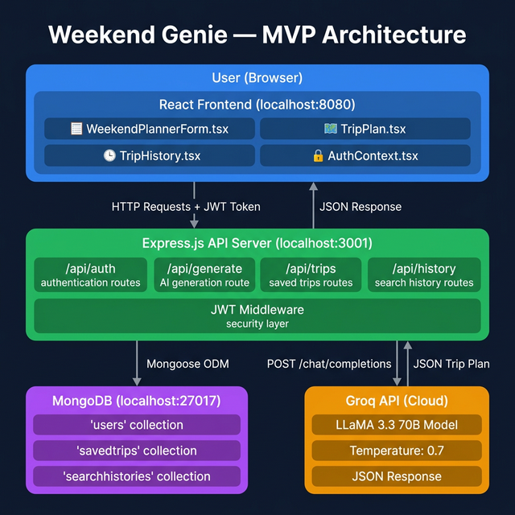

# 🧞 Weekend Genie — AI-Powered Travel Planner

Weekend Genie is a full-stack web application that generates personalized weekend trip itineraries using AI. Users provide their budget, group size, and destination preference — and the AI creates a complete plan with accommodations, meals, activities, and local hidden gems.

## 📊 MVP Architecture Diagram



---

## 🏗️ Architecture Overview

```
┌──────────────────────────────────────────────────────────────────┐
│                        USER (Browser)                            │
│  React + TypeScript + Vite + Tailwind CSS + shadcn/ui            │
│  Running on: http://localhost:8080                                │
└──────────────┬──────────────────────────────────┬────────────────┘
               │                                  │
               │  HTTP Requests (fetch)            │
               │  Authorization: Bearer <JWT>      │
               ▼                                  ▼
┌──────────────────────────────────────────────────────────────────┐
│                    EXPRESS.JS API SERVER                          │
│                 Running on: http://localhost:3001                 │
│                                                                  │
│  ┌──────────────┐  ┌──────────────┐  ┌────────────────────────┐  │
│  │  /api/auth   │  │  /api/trips  │  │  /api/generate         │  │
│  │  - signup    │  │  - list      │  │  - trip-plan           │  │
│  │  - login     │  │  - create    │  │    (calls Groq API)    │  │
│  │  - me        │  │  - delete    │  │                        │  │
│  │  - signout   │  │  - favorite  │  └───────────┬────────────┘  │
│  └──────┬───────┘  └──────┬───────┘              │               │
│         │                 │          ┌───────────┐│               │
│  ┌──────┴─────┐           │          │ /api/     ││               │
│  │ JWT Auth   │           │          │ history   ││               │
│  │ Middleware │           │          │ - list    ││               │
│  └────────────┘           │          │ - create  ││               │
│                           │          │ - delete  ││               │
│                           │          └─────┬─────┘│               │
└───────────────────────────┼────────────────┼──────┼──────────────┘
                            │                │      │
                            ▼                ▼      │
                   ┌─────────────────────────────┐  │
                   │     MongoDB (Local)         │  │
                   │  mongodb://localhost:27017   │  │
                   │  Database: weekend-genie    │  │
                   │                             │  │
                   │  Collections:               │  │
                   │  ├── users                  │  │
                   │  ├── savedtrips             │  │
                   │  └── searchhistories        │  │
                   └─────────────────────────────┘  │
                                                    │
                                                    ▼
                                        ┌───────────────────┐
                                        │    GROQ API       │
                                        │  (External Cloud) │
                                        │                   │
                                        │  Model: LLaMA 3.3 │
                                        │  70B Versatile    │
                                        │                   │
                                        │  Returns: JSON    │
                                        │  trip itinerary   │
                                        └───────────────────┘
```

---

## 🔄 Data Flow — How a Trip Plan Is Generated

### Step-by-step flow from user input to AI-generated plan:

```
 ① USER fills form                    ② Frontend sends POST request
 ┌─────────────────────┐              ┌──────────────────────────────────┐
 │ Budget: ₹5000       │    ──────►   │ POST /api/generate/trip-plan     │
 │ People: 2           │              │ Body: { budget, numberOfPeople,  │
 │ Destination: Beach   │              │   destinationPreference,         │
 │ Surprise Me: false  │              │   surpriseMe }                   │
 └─────────────────────┘              └──────────────┬───────────────────┘
                                                     │
                                                     ▼
 ④ AI returns JSON response           ③ Backend builds prompt & calls Groq
 ┌─────────────────────────┐          ┌──────────────────────────────────┐
 │ {                       │          │ System: "You are a travel        │
 │   destination: "Goa",   │  ◄────  │   planner for India..."          │
 │   summary: "...",       │          │ User: "Generate a trip plan      │
 │   accommodations: [...],│          │   for 2 people, ₹5000 budget,   │
 │   meals: { day1, day2 },│          │   Beach destination..."          │
 │   activities: [...],    │          │                                  │
 │   localSecret: "..."    │          │ Model: llama-3.3-70b-versatile   │
 │ }                       │          │ Temperature: 0.7                 │
 └────────────┬────────────┘          │ Max tokens: 2000                 │
              │                       └──────────────────────────────────┘
              ▼
 ⑤ Frontend renders the plan          ⑥ User can save trip (if logged in)
 ┌─────────────────────────┐          ┌──────────────────────────────────┐
 │ 🏨 Accommodations       │          │ POST /api/trips                  │
 │ 🍽️ Meals (Day 1 & 2)   │  ──────► │ Saves to MongoDB 'savedtrips'   │
 │ 🧭 Activities           │          │ collection with user_id          │
 │ ✨ Local Secret         │          └──────────────────────────────────┘
 │ 💾 Save / Share buttons │
 └─────────────────────────┘
```

### Authentication Flow:

```
 SIGNUP                                LOGIN
 ┌──────────────────────┐             ┌──────────────────────┐
 │ POST /api/auth/signup │             │ POST /api/auth/login  │
 │ { email, password,   │             │ { email, password }   │
 │   full_name }        │             └──────────┬───────────┘
 └──────────┬───────────┘                        │
            │                                    │
            ▼                                    ▼
 ┌──────────────────────┐             ┌──────────────────────┐
 │ Password hashed with │             │ Password compared    │
 │ bcrypt (12 rounds)   │             │ with bcrypt          │
 │ User saved to MongoDB│             │                      │
 └──────────┬───────────┘             └──────────┬───────────┘
            │                                    │
            ▼                                    ▼
 ┌────────────────────────────────────────────────────────────┐
 │ JWT token generated (expires in 7 days)                    │
 │ Token stored in browser's localStorage                     │
 │ Token sent as "Authorization: Bearer <token>" on requests  │
 └────────────────────────────────────────────────────────────┘
```

### Search History Flow:

```
 User submits a search (logged in)
            │
            ├──► POST /api/history        →  Saved to MongoDB 'searchhistories'
            │    { budget, numberOfPeople,     collection with user_id
            │      destinationPreference,
            │      surpriseMe }
            │
            └──► GET /api/history          →  Fetches user's past searches
                 Authorization: Bearer <JWT>    from MongoDB (max 20, newest first)
```

---

## 💾 MongoDB Collections (View in Compass)

Open **MongoDB Compass** and connect to `mongodb://localhost:27017`. Select the **`weekend-genie`** database. You'll see these collections:

### 1. `users`
Stores registered user accounts.

| Field        | Type     | Description                          |
|-------------|----------|--------------------------------------|
| `_id`       | ObjectId | Auto-generated unique ID             |
| `email`     | String   | User's email (unique, lowercase)     |
| `password`  | String   | Bcrypt-hashed password (12 rounds)   |
| `full_name` | String   | User's display name                  |
| `avatar_url`| String   | Profile picture URL (nullable)       |
| `createdAt` | Date     | Account creation timestamp           |
| `updatedAt` | Date     | Last update timestamp                |

### 2. `savedtrips`
Stores trip plans that users explicitly save.

| Field              | Type     | Description                              |
|-------------------|----------|------------------------------------------|
| `_id`             | ObjectId | Auto-generated unique ID                 |
| `user_id`         | ObjectId | References `users._id`                   |
| `destination`     | String   | Trip destination name                    |
| `budget`          | String   | Budget amount (e.g., "5000")             |
| `number_of_people`| String   | Group size (e.g., "2")                   |
| `trip_data`       | Object   | Full AI-generated JSON itinerary         |
| `is_favorite`     | Boolean  | Whether user marked as favorite          |
| `createdAt`       | Date     | When the trip was saved                  |
| `updatedAt`       | Date     | Last update timestamp                    |

### 3. `searchhistories`
Stores every search a logged-in user makes.

| Field                    | Type     | Description                          |
|-------------------------|----------|--------------------------------------|
| `_id`                   | ObjectId | Auto-generated unique ID             |
| `user_id`               | ObjectId | References `users._id`               |
| `budget`                | String   | Budget used in the search            |
| `numberOfPeople`        | String   | Number of people                     |
| `destinationPreference` | String   | Destination entered (or empty)       |
| `surpriseMe`            | Boolean  | Whether "Surprise Me" was checked    |
| `destination`           | String   | AI-generated destination (if saved)  |
| `createdAt`             | Date     | When the search was made             |
| `updatedAt`             | Date     | Last update timestamp                |

---

## 🛠️ Tech Stack

| Layer       | Technology                                              |
|-------------|--------------------------------------------------------|
| **Frontend**| React 18, TypeScript, Vite, Tailwind CSS, shadcn/ui    |
| **Backend** | Node.js, Express.js 5, Mongoose 9                      |
| **Database**| MongoDB (local, via MongoDB Compass)                   |
| **AI Model**| LLaMA 3.3 70B Versatile (via Groq API)                 |
| **Auth**    | JWT (jsonwebtoken) + bcryptjs password hashing         |
| **Styling** | Tailwind CSS + custom gradients + Framer Motion        |

---

## 📁 Project Structure

```
weekend-genie/
├── README.md                          # This file
├── .gitignore                         # Git ignore rules
│
├── frontend/                          # React + Vite frontend
│   ├── .env                           # VITE_API_URL=http://localhost:3001/api
│   ├── index.html                     # HTML entry point
│   ├── package.json                   # Frontend dependencies
│   ├── vite.config.ts                 # Vite configuration
│   ├── tailwind.config.ts             # Tailwind CSS configuration
│   ├── tsconfig.json                  # TypeScript configuration
│   ├── components.json                # shadcn/ui configuration
│   └── src/
│       ├── main.tsx                   # App entry point
│       ├── App.tsx                    # Router setup
│       ├── index.css                  # Global styles
│       ├── components/
│       │   ├── WeekendPlannerForm.tsx  # Main trip planning form
│       │   ├── TripPlan.tsx           # AI-generated plan display
│       │   ├── TripHistory.tsx        # User search history (from MongoDB)
│       │   ├── ShareTripPlan.tsx      # Trip sharing options
│       │   ├── VoiceInput.tsx         # Speech-to-text input
│       │   ├── ProfileMenu.tsx        # User dropdown menu
│       │   ├── ProfileSidebar.tsx     # Profile sidebar
│       │   ├── ThemeToggle.tsx        # Dark/light mode toggle
│       │   ├── ComparisonSlider.tsx   # AI vs manual comparison
│       │   ├── RecommendationsSection.tsx  # Popular destinations
│       │   └── ui/                    # shadcn/ui components
│       ├── contexts/
│       │   ├── AuthContext.tsx         # JWT authentication state
│       │   └── ThemeContext.tsx        # Theme management
│       ├── pages/
│       │   ├── Index.tsx              # Homepage
│       │   ├── Auth.tsx               # Login / Signup page
│       │   ├── MyTrips.tsx            # Saved trips page
│       │   └── Profile.tsx            # User profile page
│       └── hooks/
│           └── use-toast.ts           # Toast notification hook
│
├── backend/                           # Express.js API server
│   ├── .env                           # GROQ_API_KEY, MONGODB_URI, JWT_SECRET
│   ├── index.js                       # Server entry point
│   ├── package.json                   # Backend dependencies
│   ├── models/
│   │   ├── User.js                    # User schema (bcrypt hashing)
│   │   ├── SavedTrip.js              # Saved trips schema
│   │   └── SearchHistory.js          # Search history schema
│   ├── middleware/
│   │   └── auth.js                    # JWT authentication middleware
│   └── routes/
│       ├── auth.js                    # Signup, login, me, signout
│       ├── trips.js                   # CRUD for saved trips
│       ├── generate.js                # AI plan generation (Groq API)
│       └── history.js                 # Search history CRUD
```

---

## 🚀 How to Run the Project

### Prerequisites

1. **Node.js** (v18 or later) — [Download](https://nodejs.org/)
2. **MongoDB Community Server** — [Download](https://www.mongodb.com/try/download/community)
3. **MongoDB Compass** (optional, for viewing data) — [Download](https://www.mongodb.com/products/compass)
4. **Groq API Key** — [Get one free at console.groq.com](https://console.groq.com/)

### Step 1: Clone the Repository

```bash
git clone https://github.com/MALLIKARJUNAREDDYgali/weekend-genie.git
cd weekend-genie
```

### Step 2: Start MongoDB

Make sure MongoDB is running. You can:
- Open **MongoDB Compass** and connect to `mongodb://localhost:27017`
- Or run `mongod` in a terminal

### Step 3: Set Up the Backend

```bash
cd backend
npm install
```

Create a `.env` file in the `backend/` folder:

```env
GROQ_API_KEY=your_groq_api_key_here
MONGODB_URI=mongodb://localhost:27017/weekend-genie
JWT_SECRET=your-secret-key-here
PORT=3001
```

> ⚠️ Replace `your_groq_api_key_here` with your actual Groq API key from [console.groq.com](https://console.groq.com/).

Start the backend server:

```bash
node index.js
```

You should see:
```
✅ Connected to MongoDB
🚀 Server running on http://localhost:3001
```

### Step 4: Set Up the Frontend

Open a **new terminal**:

```bash
cd frontend
npm install
npm run dev
```

You should see:
```
VITE ready in ~1s
➜ Local: http://localhost:8080/
```

### Step 5: Open the App

Go to **http://localhost:8080** in your browser. 🎉

---

## 🔑 API Endpoints

| Method   | Endpoint                  | Auth Required | Description                         |
|----------|--------------------------|:------------:|--------------------------------------|
| `POST`   | `/api/auth/signup`       |      ❌      | Create a new account                 |
| `POST`   | `/api/auth/login`        |      ❌      | Login and receive JWT                |
| `GET`    | `/api/auth/me`           |      ✅      | Get current user info                |
| `POST`   | `/api/auth/signout`      |      ❌      | Sign out (client deletes token)      |
| `POST`   | `/api/generate/trip-plan`|      ❌      | Generate AI trip plan                |
| `GET`    | `/api/trips`             |      ✅      | List user's saved trips              |
| `POST`   | `/api/trips`             |      ✅      | Save a trip                          |
| `PATCH`  | `/api/trips/:id/favorite`|      ✅      | Toggle trip favorite                 |
| `DELETE` | `/api/trips/:id`         |      ✅      | Delete a saved trip                  |
| `GET`    | `/api/history`           |      ✅      | Get user's search history            |
| `POST`   | `/api/history`           |      ✅      | Save a search to history             |
| `DELETE` | `/api/history/:id`       |      ✅      | Delete a history item                |
| `DELETE` | `/api/history`           |      ✅      | Clear all user history               |
| `GET`    | `/api/health`            |      ❌      | Health check                         |

---

## 🔒 Security

| Concern                | Solution                                               |
|-----------------------|--------------------------------------------------------|
| **API Key exposure**  | Groq API key is in backend `.env` only, never in frontend |
| **Password storage**  | Hashed with bcrypt (12 salt rounds), never stored as plain text |
| **Authentication**    | JWT tokens with 7-day expiry                           |
| **Data isolation**    | Each user can only access their own trips and history   |
| **CORS**              | Only whitelisted frontend origins can access the API    |

---

## 🤖 AI Model Details

| Property       | Value                                    |
|---------------|------------------------------------------|
| **Provider**  | [Groq](https://groq.com/) (fast inference) |
| **Model**     | `llama-3.3-70b-versatile`                |
| **Parameters**| 70 billion                               |
| **Temperature**| 0.7 (balanced creativity)               |
| **Max Tokens**| 2000                                     |
| **Response**  | Structured JSON with places, costs, addresses |
| **Latency**   | ~3-8 seconds per request                 |

The AI is instructed via a carefully crafted system prompt to:
- Act as a knowledgeable travel planner for India
- Recommend real places with real addresses
- Stay within the user's budget
- Suggest authentic local cuisine
- Include both popular and offbeat activities
- Return a strict JSON schema for consistent rendering

---

## 📸 Features

- ✨ **AI-powered trip generation** — Budget-aware itineraries in seconds
- 🔐 **User authentication** — JWT-based signup/login
- 📝 **Search history** — Automatically saved per user in MongoDB
- 💾 **Save trips** — Bookmark favorite itineraries
- 🎤 **Voice input** — Speak your budget or destination
- 🌙 **Dark mode** — Toggle between light and dark themes
- 📱 **Responsive** — Works on mobile, tablet, and desktop
- 🔗 **Share trips** — Share via WhatsApp or copy link
- 🎯 **Surprise Me** — Let the AI pick a random destination
- 📊 **Trip comparison** — Interactive slider showing AI vs manual planning

---

## 📝 License

This project is open source and available under the [ISC License](LICENSE).
